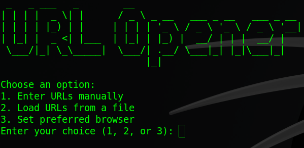

# URL Opener

---



## About

URLOpener is a Python-based utility designed to simplify the process of opening multiple URLs efficiently in your preferred web browser.

This tool is particularly useful for tasks like web inspection, research, or automation where you need to access several links quickly and seamlessly.

## Features

- Open URLs in Bulk: Enter URLs manually or load them from a file to open them all at once in your browser.

- Preferred Browser Selection: Choose your browser (Brave, Chrome, Firefox, Edge, or Default) for a personalized experience.

- User-Friendly Interface: Simple menu-driven navigation with clear instructions.

## Use

### Prerequisites

- Python 3.x installed on your system.

- Ensure the required browsers are installed if you want to use a specific one.

### Installation

1. Clone this repository or download the script file.

```
git clone https://github.com/04s1s/UrlOpener
cd UrlOpener
```

2. Make sure you have permissions to execute the script.

```
chmod +x urlopener.py
```

### Running the Script

1. Launch the script:

```
python urlopener.py
```

2. Menu Options:

`1`: Enter URLs manually (type each URL and end with "done").

`2`: Load URLs from a file (use tab completion to specify the file path).

`3`: Set your preferred browser (choose from Brave, Chrome, Firefox, Edge, or Default).

---

Follow the prompts and let UrlOpener handle the rest!😉
